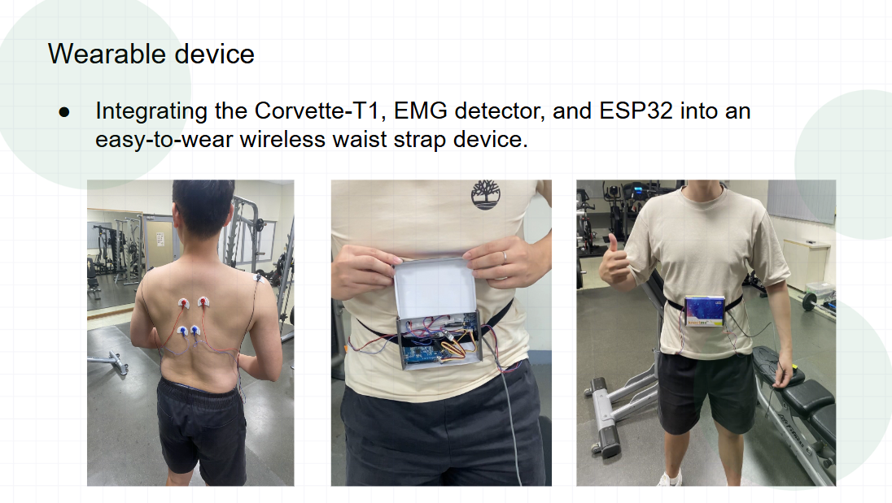
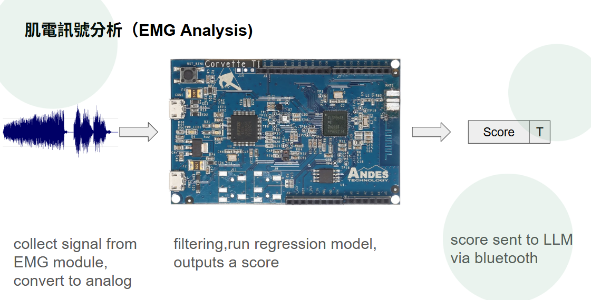

# Andes: EMG + Pose AI Fitness Coaching System

An end-to-end prototype for real-time exercise coaching using:

- EMG signals from Arduino hardware
- webcam pose tracking (MediaPipe)
- PyTorch sequence models
- optional local LLM coaching (Ollama + Breeze)
- desktop UI (PySide6) + TTS feedback

This README covers the runtime flow, hardware context, model assets, firmware entrypoints, and demo assets for the prototype.

---

## Table of Contents

1. Project Scope
2. Project Preview
3. Hardware Setup
4. Repository Structure
5. Core Runtime Pipeline
6. Environment Setup
7. Quick Start
8. Configuration Reference
9. Data Formats and Contracts
10. Training Workflow
11. Firmware Notes
12. Legacy Scripts
13. GitHub Push Checklist
14. Troubleshooting
15. Current Cleanup Status

---

## 1. Project Scope

This repository focuses on a local-first AI coaching workflow:

- **Input A (EMG):** left/right muscle activation and balance from the embedded device
- **Input B (Pose):** body landmarks from camera stream
- **Fusion:** event slicing by motion, pose classification, rep counting, EMG-side interpretation
- **Output:** on-screen state + optional LLM-generated coaching + TTS

Main runtime entrypoint:

- `video_v2.py`

---

## 2. Project Preview

### 2.1 Demo video

- [Watch the end-to-end prototype demo](image/Combine.mp4)

### 2.2 Wearable prototype

<p align="center">
  
</p>

A belt-mounted prototype integrates the Corvette-T1 board, EMG detector, and ESP32 into a wearable package for untethered gym use.

### 2.3 Embedded EMG scoring path

<p align="center">
  
</p>

The embedded path collects analog EMG, filters the signal, runs a regression model on-device, and sends a compact score over Bluetooth to the desktop coaching app.

---

## 3. Hardware Setup

Core components:

- Corvette-T1 board for EMG acquisition and embedded inference
- EMG detector front-end and electrodes for left/right muscle signals
- ESP32 / BLE path exposing Nordic UART Service compatible data
- host PC with webcam for pose tracking and desktop UI feedback

### 3.1 How It Works in One Minute

1. The wearable streams EMG-derived values to the host over BLE.
2. The webcam captures body landmarks through MediaPipe Pose.
3. Motion events are segmented, normalized, and classified by `PoseLSTM`.
4. EMG samples are sliced by event time and fused with pose results for rep and side feedback.
5. Optional Ollama + Breeze generates coaching text, which can be spoken via TTS.

---

## 4. Repository Structure

```text
andes/
|-- video_v2.py                        # Main desktop app (UI + BLE + pose + rep + LLM/TTS)
|-- pc_realtime_integrator.py          # Runtime integration script (no GUI)
|-- Breeze.py                          # Ollama request wrapper
|-- camera.py                          # Data collection: save action_XXX.csv
|-- train_pose_lstm.py                 # Pose classifier training
|-- train_emg_lstm.py                  # EMG LSTM training
|-- train_emg40_tf_int8.py             # EMG TensorFlow INT8 training/export
|-- tflite_to_h.py                     # Convert .tflite to C header
|-- pose_lstm.pt                       # Pose model weights
|-- emg_lstm.pt                        # EMG model weights
|-- emg40_mlp_int8.tflite              # Quantized model for MCU path
|-- emg40_model.h                      # C header generated from tflite
|-- model.pt                           # Legacy model artifact
|-- LR_score.xlsx                      # Label/score source for training
|-- requirements.txt
|-- .gitignore
|-- image/
|   |-- Combine.mp4
|   |-- device.png
|   `-- wearable_device.png
|-- legacy/
|   |-- README.md
|   |-- LSTM.py
|   |-- test.py
|   |-- t.py
|   `-- score_1dim.py
|-- main/
|   |-- main.ino
|   |-- model_infer.c
|   |-- model_infer.h
|   `-- model_weights.h
`-- Corvette-T1_arduinoIOT/
    `-- Corvette-T1_arduinoIOT.ino
```

Large local folders are intentionally ignored in git:

- `Training_Data/`
- `data/`
- `collected_data/`
- `pose_output/`
- `combined_output/`
- `backup_before_swap/`

---

## 5. Core Runtime Pipeline

`video_v2.py` high-level flow:

1. Start camera + MediaPipe pose tracking.
2. Start BLE EMG listener (Nordic UART Service).
3. Detect motion event start/end from landmark velocity.
4. Normalize + resample pose sequence to fixed length.
5. Run `PoseLSTM` classifier.
6. Slice EMG samples by event timestamps and compute summary.
7. Update rep count and UI labels.
8. Queue optional LLM coaching text.
9. Speak feedback via TTS.

Logical data flow:

```text
EMG Device -> BLE/Serial -> EMG Buffer -> Event Time Slice -> Coach Prompt
Webcam -> MediaPipe Pose -> Event Segment -> PoseLSTM Class -> Coach Prompt
Coach Prompt -> Ollama/Breeze (optional) -> UI + TTS
```

---

## 6. Environment Setup

### 6.1 Hardware prerequisites

- webcam for pose tracking
- BLE EMG device advertising Nordic UART Service compatible telemetry
- wearable hardware path built from Corvette-T1, EMG detector, and ESP32
- optional speaker or headphones for TTS playback

### 6.2 Python

Recommended: Python 3.10+ on Windows.

### 6.3 Install dependencies

```bash
pip install -r requirements.txt
```

If Excel parsing fails:

```bash
pip install openpyxl
```

### 6.4 Optional local LLM

If you want coaching text from LLM:

1. Install Ollama
2. Start Ollama service (`http://localhost:11434`)
3. Ensure model in `Breeze.py` exists:
   - default: `jcai/breeze-7b-instruct-v1_0:q4_0`

If Ollama is not running, core app logic still works; only LLM responses fail/skip.

---

## 7. Quick Start

### 7.1 Main UI app

```bash
python video_v2.py
```

Before running:

- camera connected
- EMG device powered and advertising BLE UART service
- `pose_lstm.pt` present in repository root

### 7.2 Realtime integrator script (no GUI)

```bash
python pc_realtime_integrator.py
```

### 7.3 Data collection

```bash
python camera.py
```

Output:

- `collected_data/action_001.csv`, `action_002.csv`, ...

---

## 8. Configuration Reference

### 8.1 Runtime app (`video_v2.py`)

Key constants:

- `POSE_MODEL_PATH = "pose_lstm.pt"`
- `NUM_CLASSES = 4`
- `POSE_TARGET_FRAMES = 110`
- `START_SPEED_TH = 0.010`
- `STOP_SPEED_TH = 0.006`
- `STOP_HOLD_FRAMES = 12`
- `MIN_EVENT_DURATION_SEC = 1.2`
- `REP_MIN_RANGE = 0.06`
- `REP_REFRACT_SEC = 0.40`
- `EMG_KEEP_SEC = 15.0`
- `UART_SERVICE_UUID = "6E400001-B5A3-F393-E0A9-E50E24DCCA9E"`
- `UART_TX_UUID = "6E400003-B5A3-F393-E0A9-E50E24DCCA9E"`
- `BLE_DEVICE_NAME_FALLBACK = "CorvetteT1-EMG"`

LLM queue behavior:

- `LLM_MAX_QUEUE = 20`
- `LLM_EXPIRE_SEC = 4.0`
- cooldown uses `COACH_COOLDOWN_SEC` (later definition is active)

### 8.2 Collector (`camera.py`)

Key constants:

- `SERIAL_PORT = "COM9"`
- `BAUD_RATE = 115200`
- `CAMERA_INDEX = 1`
- `ACTION_DURATION = 5.0`
- `TARGET_SAMPLES = 110`
- `POST_READ_SECONDS = 3.0`
- `MIN_VALID_ROWS = 100`
- `OUTPUT_FOLDER = "collected_data"`

---

## 9. Data Formats and Contracts

### 9.1 EMG device line format

Expected input line:

```text
tmillis,Lp,Rp,imbalance,magnitude,finalL,finalR
```

Some paths also accept 6-column format without `tmillis`.

### 9.2 Collected training CSV (`action_XXX.csv`)

`camera.py` writes:

- `EMG_L_Norm`
- `EMG_R_Norm`
- `Node0_X`, `Node0_Y`, `Node0_Z`, ...
- ...
- `Node32_X`, `Node32_Y`, `Node32_Z`

Total per row:

- 2 EMG features + 99 pose features = 101 features

### 9.3 Model files

- `pose_lstm.pt`: used by runtime pose classifier
- `emg_lstm.pt`: EMG regression model (training artifact)
- `emg40_mlp_int8.tflite`: quantized TensorFlow model
- `emg40_model.h`: C header for firmware integration

---

## 10. Training Workflow

### 10.1 Pose classifier

```bash
python train_pose_lstm.py --data_dir ./collected_data --xlsx ./LR_score.xlsx
```

Default args:

- `--epochs 100`
- `--window 30`
- `--stride 5`

Output:

- `pose_lstm.pt`

### 10.2 EMG LSTM

```bash
python train_emg_lstm.py --data_dir ./collected_data --xlsx ./LR_score.xlsx
```

Default args:

- `--epochs 100`
- `--window 40`
- `--stride 10`

Output:

- `emg_lstm.pt`

### 10.3 TensorFlow INT8 EMG model

```bash
python train_emg40_tf_int8.py --data_dir ./collected_data --xlsx ./LR_score.xlsx
python tflite_to_h.py
```

Default args:

- `--epochs 80`
- `--window 40`
- `--stride 10`
- `--batch 256`

Outputs:

- `emg40_mlp_int8.tflite`
- `emg40_model.h`

---

## 11. Firmware Notes

`main/main.ino` handles:

- 1kHz sampling
- HP/LP/notch filtering
- adaptive MVC normalization
- 40-step sliding window inference
- CSV line output to host

Alternative firmware snapshot:

- `Corvette-T1_arduinoIOT/Corvette-T1_arduinoIOT.ino`

---

## 12. Legacy Scripts

Legacy scripts were moved to `legacy/` for cleaner root structure:

- `legacy/LSTM.py`
- `legacy/test.py`
- `legacy/t.py`
- `legacy/score_1dim.py`

These are retained for historical/experimental reference, not the recommended main path.

See details in:

- `legacy/README.md`

---

## 13. GitHub Push Checklist

### 13.1 Before commit

1. Verify large local folders are ignored (`Training_Data`, `data`, `collected_data`).
2. Confirm no temporary artifacts are staged.
3. Optionally keep or remove model binaries depending on repository policy.

### 13.2 Basic push commands

```bash
git init
git add .
git commit -m "Initial commit: Andes EMG + Pose AI coaching system"
git branch -M main
git remote add origin <YOUR_REPO_URL>
git push -u origin main
```

If remote already exists:

```bash
git remote set-url origin <YOUR_REPO_URL>
git push -u origin main
```

---

## 14. Troubleshooting

- `ModuleNotFoundError`
  - Reinstall via `pip install -r requirements.txt`
- BLE device not found
  - Confirm advertised UART service UUID and fallback device name
- Camera open failure
  - Try changing camera index in script
- `state_dict` load error
  - Ensure architecture and model file match
- Slow or stale LLM responses
  - Check Ollama status, model availability, and queue expiry settings

---

## 15. Current Cleanup Status

Completed:

- Added `.gitignore` for large data and temporary artifacts
- Removed cached/compressed/generated redundant files
- Grouped legacy scripts under `legacy/`
- Upgraded README for maintainability and GitHub publishing

Suggested next cleanup (optional):

1. Move model files into a dedicated `models/` folder and update paths.
2. Add `LICENSE`.
3. Add a small `configs.py` to centralize runtime constants.
4. Add smoke tests for model loading and CSV schema checks.
